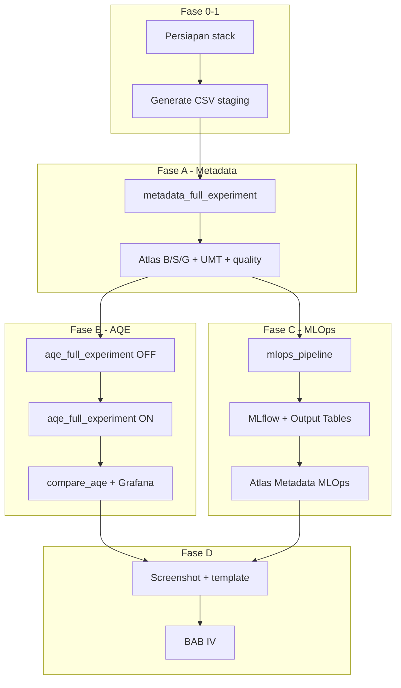

# Panduan Eksperimen — Data Lakehouse Insight (Metadata · AQE · MLOps)

Panduan operasional menjalankan **tiga metode penelitian** dalam satu stack Docker, mengumpulkan metrik ke `metrics/`, dan mencatat bukti untuk **BAB III** serta **BAB IV** (acuan [`../../README.md`](../../README.md)).

**Diagram acuan (root repo):**

| Diagram | File | Metode |
|---------|------|--------|
| Gabungan | [`../../MLOps-pipeline.png`](../../MLOps-pipeline.png) | Insight §1.1 |
| Metadata | [`../../Bigdata-pipeline-Metadata.jpg`](../../Bigdata-pipeline-Metadata.jpg) | §1.2 |
| AQE | [`../../pipeline-aqe.png`](../../pipeline-aqe.png) | §1.3 |

**Dokumen terkait:**

| Topik | Lokasi |
|-------|--------|
| Arsitektur & BAB IV | [`../../README.md`](../../README.md) |
| Pipeline Metadata | [`../staging-to-bronze/`](../staging-to-bronze/README.md) · [`../bronze-to-silver/`](../bronze-to-silver/README.md) · [`../silver-to-gold/`](../silver-to-gold/README.md) |
| Ringkasan AQE | [`../aqe/README.md`](../aqe/README.md) |
| Ringkasan MLOps | [`../mlops/README.md`](../mlops/README.md) |
| Benchmark | [`../../scripts/benchmark/README.md`](../../scripts/benchmark/README.md) |
| Generate data staging | [`../generate-data/README.md`](../generate-data/README.md) |
| Gold → Serving & dashboard KPI | [`../gold-to-serving/README.md`](../gold-to-serving/README.md) |
| InsightERA Portal | [`../portal/README.md`](../portal/README.md) |
| Grafana (Insight + MLOps + AQE) | [`../monitoring-grafana/README.md`](../monitoring-grafana/README.md) |
| Template isian | [`templates/`](templates/) |

---

## 0. Jalur eksperimen utama (disarankan)

### 0.1 Urutan DAG — satu run penelitian

```bash
cd /path/to/Data-Lakehouse-Insight
cp .env.example .env          # opsional
# Generate CSV staging — panduan: docs/generate-data/README.md
./scripts/generate_data.sh full              # profil metadata (~80k baris)
# ./scripts/generate_data.sh full insight    # E2E ringan + skew
# ./scripts/generate_data.sh full aqe          # eksperimen AQE penuh (~1M mhs)
./start.sh
mkdir -p metrics && chmod 1777 metrics

# ── Fase A: Metadata (Medallion + Atlas + UMT) ──
docker exec lhmeta-airflow-scheduler airflow dags trigger metadata_full_experiment

# ── Fase B: AQE OFF lalu ON (warehouse ganda + workload) ──
docker exec lhmeta-airflow-scheduler airflow dags trigger aqe_full_experiment

# ── Fase C: MLOps (Gold → model → output tables) ──
docker exec lhmeta-airflow-scheduler airflow dags trigger mlops_pipeline
```

Pantau semua DAG di http://localhost:18681 (user: `airflow` / `airflow`).

> **Catatan:** `metadata_full_experiment` menulis ke schema `lakehouse.bronze/silver/gold` (satu salinan governance). `aqe_full_experiment` menulis **salinan terpisah** `*_aqe_off` / `*_aqe_on` untuk audit performa — tidak menimpa Gold utama.

### 0.2 Dua skenario laporan (inti penelitian)

| Skenario | Metadata | AQE | MLOps | Kapan diukur |
|----------|----------|-----|-------|--------------|
| **Insight-OFF** | ✅ penuh | ❌ OFF | ✅ (setelah Gold) | Setelah `aqe_full_experiment` — gunakan cabang OFF |
| **Insight-ON** | ✅ penuh | ✅ ON | ✅ (setelah Gold) | Cabang ON + feature join lebih cepat |

Variabel **independen utama:** `SPARK_AQE_SCENARIO` = `OFF` vs `ON`.  
Variabel **dependen:** kualitas metadata, runtime pipeline/query, metrik model MLOps.

### 0.3 Output metrik (`metrics/`)

| File | Metode | Subbab laporan |
|------|--------|----------------|
| `experiment_summary_latest.json` | Gabungan | Ringkasan run |
| `metadata_quality_latest.json` | Metadata | §4.1.6 kualitas |
| `atlas_inventory_latest.json` | Metadata | coverage + lineage |
| `umt_latest.json` | Metadata | §4.1.4 UMT |
| `aqe_comparison_*.json` | AQE | §4.1.2–4.1.4 performa |
| `bronze_to_silver_aqe_OFF_*.json` / `ON_*.json` | AQE | speedup Silver |
| `workloads_spark_aqe_*.json` | AQE | workload W1–W3 |
| `workloads_trino_ctx_*.json` | AQE | workload W4–W6 (Trino) |
| `staging_to_bronze_*.json`, `silver_to_gold_*.json` | Metadata | §4.1.1 runtime |

---

## 1. Diagram alur eksperimen (tiga metode)



---

## 2. Pemetaan fase → Metodologi → Hasil

| Fase | Aktivitas | DAG / perintah | BAB III | BAB IV |
|------|-----------|----------------|---------|--------|
| **0** | Stack Docker + metrics | `./start.sh` | Lingkungan | Konteks |
| **1** | Dataset ITERA | `generate_data.sh full` / `append` | Dataset | Deskripsi data |
| **A** | Metadata Medallion + Atlas | `metadata_full_experiment` | Metadata governance | §4.1.1–4.1.2, §4.1.4, §4.1.6 |
| **B** | AQE OFF/ON + workload | `aqe_full_experiment` | AQE config | §4.1.2–4.1.4, §4.1.6 query |
| **C** | MLOps train + infer | `mlops_pipeline` | ML lifecycle | §4.1.4 MLOps, §4.1.5 |
| **D** | Banding OFF vs ON | template 11 | Desain eksperimen | §4.1.5, §4.2.4 |
| **E** | Screenshot & kompilasi | manual | — | §4.1.3, §4.1.5 |
| **F** | Pembahasan | template 08 | — | §4.2 |

---

## 3. Fase 0 — Persiapan lingkungan

```bash
cd Data-Lakehouse-Insight
./scripts/download-jars.sh    # atau otomatis lewat start.sh
./start.sh
docker compose ps             # lhmeta-* Running / healthy
mkdir -p metrics docs/screenshots && chmod 1777 metrics
```

Template: [`templates/01-lingkungan-eksperimen.md`](templates/01-lingkungan-eksperimen.md)

| Layanan | URL | Kredensial |
|---------|-----|-----------|
| Airflow | http://localhost:18681 | airflow / airflow |
| Atlas | http://localhost:22100 | admin / admin |
| InsightERA Portal | http://localhost:13000 | Katalog + dashboard embed |
| Spark UI | http://localhost:18080 | — |
| Trino | http://localhost:18088 | — |
| Superset | http://localhost:18089 | admin / admin |
| Grafana (AQE) | http://localhost:13001 | admin / admin |
| MLflow | http://localhost:15500 | — |
| MinIO Console | http://localhost:19001 | minioadmin / minioadmin123 |

**Persyaratan:** RAM ≥ 16 GB disarankan (Atlas + Spark + MLflow + monitoring).

---

## 4. Fase 1 — Generate dataset

Panduan lengkap: [`../generate-data/README.md`](../generate-data/README.md)

```bash
# Rencana volume
./scripts/generate_data.sh dry-run aqe

# Default penelitian Insight (metadata, ~80k baris)
./scripts/generate_data.sh full

# E2E + skew sedang
# ./scripts/generate_data.sh full insight

# AQE penuh (~1M mahasiswa)
# ./scripts/generate_data.sh full aqe

python3 scripts/count_staging_rows.py
ls -la data/staging/*.csv
```

**Tambah baris lalu uji ulang:**

```bash
./scripts/generate_data.sh append 5000
python3 scripts/count_staging_rows.py
# lalu trigger ulang DAG yang relevan
```

Ringkasan otomatis (JSON metrik):

```bash
PYTHONPATH=scripts INSIGHT_METRICS_DIR=metrics \
  python3 scripts/benchmark/dataset_summary.py --staging-dir data/staging
```

Template: [`templates/02-dataset.md`](templates/02-dataset.md)

---

## 5. Fase A — Metode Metadata

**DAG:** `metadata_full_experiment`  
**Tujuan:** Medallion + registrasi Atlas per layer + UMT + skor kualitas metadata.

```bash
docker exec lhmeta-airflow-scheduler airflow dags trigger metadata_full_experiment
```

**Task utama (berurutan):**

| Task | Proses |
|------|--------|
| upload_staging_to_minio | CSV → bucket `staging` |
| dataset_summary | `metrics/dataset_summary_*.json` |
| staging_to_bronze | Iceberg Bronze + profiling |
| register_bronze_atlas | Technical + lineage + PII |
| bronze_to_silver | Quality gate + Silver tables |
| register_silver_atlas | Business + compliance metadata |
| silver_to_gold | Star schema 5 dim + 10 fakta IKU |
| register_gold_atlas | KPI + consumption metadata |
| collect_umt | `umt_latest.json` |
| evaluate_metadata_quality | `metadata_quality_latest.json` |
| atlas_inventory | `atlas_inventory_latest.json` |
| aggregate_results | `experiment_summary_latest.json` |

**Verifikasi cepat:**

```bash
curl -sf -u admin:admin -X POST http://localhost:22100/api/atlas/v2/search/basic \
  -H "Content-Type: application/json" \
  -d '{"typeName":"lakehouse_dataset","classification":"Gold_Layer","limit":5}'
open http://localhost:13000/metadata-quality
```

Template: [`templates/03-runtime-pipeline.md`](templates/03-runtime-pipeline.md), [`templates/04-kualitas-metadata.md`](templates/04-kualitas-metadata.md), [`templates/05-coverage-lineage.md`](templates/05-coverage-lineage.md), [`templates/07-umt-enrichment.md`](templates/07-umt-enrichment.md)

**Manual (jika per layer saja):**

```bash
docker exec lhmeta-airflow-scheduler airflow dags trigger staging_to_bronze_pipeline
docker exec lhmeta-airflow-scheduler airflow dags trigger bronze_silver_metadata_pipeline
docker exec lhmeta-airflow-scheduler airflow dags trigger silver_to_gold_pipeline
```

---

## 6. Fase B — Metode AQE (OFF vs ON)

**DAG:** `aqe_full_experiment`  
**Tujuan:** Perbandingan terkontrol AQE; penyimpanan ganda Silver/Gold; workload Spark + Trino.

```bash
docker exec lhmeta-airflow-scheduler airflow dags trigger aqe_full_experiment
```

**Alur internal DAG:**

1. Upload + dataset summary (jika staging ada)  
2. Staging → Bronze (sekali)  
3. Bronze → Silver **AQE OFF** → Spark workloads OFF → Silver → Gold OFF → Trino OFF  
4. Bronze → Silver **AQE ON** → Spark workloads ON → Silver → Gold ON → Trino ON  
5. `compare_aqe_runs` + `aggregate_results`

**Penyimpanan ganda (audit SQL):**

| Lapisan | OFF | ON |
|---------|-----|-----|
| Silver | `lakehouse.silver_aqe_off.*` | `lakehouse.silver_aqe_on.*` |
| Gold | `lakehouse.gold_aqe_off.*` | `lakehouse.gold_aqe_on.*` |
| MinIO | `warehouse-aqe-off/` | `warehouse-aqe-on/` |

```sql
-- Trino (contoh)
SELECT 'OFF', COUNT(*) FROM lakehouse.silver_aqe_off.silver_mahasiswa
UNION ALL
SELECT 'ON', COUNT(*) FROM lakehouse.silver_aqe_on.silver_mahasiswa;
```

**Metrik & monitoring:**

```bash
ls metrics/aqe_comparison_*.json metrics/bronze_to_silver_aqe_*.json
PYTHONPATH=scripts INSIGHT_METRICS_DIR=metrics \
  python3 scripts/benchmark/compare_aqe_runs.py --markdown
open http://localhost:13001    # Grafana — AQE Experiment + Dashboard Insight + MLOps Pipeline
open http://localhost:18080    # Spark UI — bandingkan app AQE_OFF vs AQE_ON
```

Panduan panel Forecast / Risk / Opportunity / Anomalies: [`../monitoring-grafana/README.md`](../monitoring-grafana/README.md)

Template: [`templates/09-perbandingan-aqe.md`](templates/09-perbandingan-aqe.md)

**Benchmark manual (opsional):**

```bash
export PYTHONPATH=scripts INSIGHT_METRICS_DIR=metrics
python3 scripts/benchmark/run_spark_workloads.py --aqe-scenario OFF
python3 scripts/benchmark/run_spark_workloads.py --aqe-scenario ON
python3 scripts/benchmark/run_trino_workloads.py --aqe-context OFF --trino-url http://localhost:18088
python3 scripts/benchmark/run_trino_workloads.py --aqe-context ON --trino-url http://localhost:18088
```

---

## 7. Fase C — Metode MLOps

**DAG:** `mlops_pipeline`  
**Tujuan:** Inference dari Gold → feature → training → batch inference → metadata model di Atlas.

```bash
# Pastikan Gold (metadata_full_experiment) sudah sukses
docker exec lhmeta-airflow-scheduler airflow dags trigger mlops_pipeline
```

**Task:**

| Task | Modul | Output |
|------|-------|--------|
| data_preprocessing | `mlops/data_preprocessing.py` | Baca tabel Gold |
| feature_engineering | `mlops/feature_engineering.py` | `s3a://mlops/features/` |
| train_models | `mlops/train_models.py` + Atlas stub | MLflow runs |
| inference_batch | `mlops/inference_batch.py` | `lakehouse.gold.fact_risk_score_mlops` |
| export_mlops_metrics | `benchmark/mlops_metrics.py` | `metrics/mlops_metrics_latest.json` → Grafana |

**Verifikasi:**

```bash
open http://localhost:15500    # MLflow — experiment risk_score_prodi
docker exec lhmeta-spark-master /opt/spark/bin/spark-sql -e \
  "SELECT COUNT(*) FROM lakehouse.gold.fact_risk_score_mlops"
```

Empat use case target (sesuai diagram MLOps):

| Output | Algoritma (rencana) | Tabel Gold |
|--------|---------------------|------------|
| Forecast | Prophet / ARIMA | `fact_forecast_iku` |
| Risk Score | XGBoost / RF | `fact_risk_score_mlops` (scaffold) |
| Opportunity | K-Means | `fact_opportunity` |
| Anomaly | PyOD | `fact_anomaly` |

Template: [`templates/10-metrik-mlops.md`](templates/10-metrik-mlops.md)

**Grafana (setelah DAG atau demo):**

```bash
PYTHONPATH=scripts INSIGHT_METRICS_DIR=metrics python3 scripts/benchmark/mlops_metrics.py --demo
open http://localhost:13001   # Dashboard Insight + MLOps Pipeline Monitoring
```

Panduan lengkap: [`../monitoring-grafana/README.md`](../monitoring-grafana/README.md)

---

## 8. Fase D — Perbandingan skenario Insight-OFF vs Insight-ON

Setelah ketiga DAG selesai, isi [`templates/11-skenario-e2e-off-on.md`](templates/11-skenario-e2e-off-on.md):

| Aspek | Insight-OFF | Insight-ON | Sumber data |
|-------|-------------|------------|-------------|
| Durasi Silver (s) | | | `bronze_to_silver_aqe_OFF_*.json` vs `ON_*.json` |
| Speedup Silver (%) | — | | `aqe_comparison_*.json` |
| Query Trino W4–W6 (s) | | | `workloads_trino_ctx_*.json` |
| Metadata completeness Gold | | | `metadata_quality_latest.json` |
| Model training time | | | MLflow UI |
| Feature join / preprocessing | | | log Airflow |

---

## 9. Fase E — Screenshot wajib

Folder: `docs/screenshots/`

| File | Sumber |
|------|--------|
| `atlas-lineage.png` | Atlas UI |
| `portal-catalog.png` | :13000/catalog |
| `portal-metadata-quality.png` | :13000/metadata-quality |
| `portal-kpi.png` | :13000/kpi |
| `grafana-aqe.png` | :13001 — dashboard AQE |
| `spark-aqe-off-on.png` | :18080 — dua aplikasi selesai |
| `mlflow-experiments.png` | :15500 |
| `superset-dashboard.png` | :18089 (opsional) |

Checklist: [`templates/06-screenshot-portal.md`](templates/06-screenshot-portal.md)

---

## 10. Fase F — Kompilasi BAB IV & pembahasan

```text
experiment-runs/
└── run-YYYY-MM-DD/
    ├── screenshots/
    ├── metrics/                 # salin seluruh metrics/*.json
    ├── templates-filled/
    └── notes-pembahasan.md
```

Salin semua template terisi dari [`templates/`](templates/).  
Pembahasan: [`templates/08-checklist-pembahasan.md`](templates/08-checklist-pembahasan.md) — tambahkan subbab AQE (§4.2.2) dan MLOps (§4.2.3) dari README utama.

---

## 11. Jadwal contoh (5 hari)

| Hari | Fokus |
|------|-------|
| **H1** | Fase 0–1: stack + generate data + template lingkungan & dataset |
| **H2** | Fase A: `metadata_full_experiment` + portal/Atlas screenshot |
| **H3** | Fase B: `aqe_full_experiment` + Grafana/Spark + template AQE |
| **H4** | Fase C: `mlops_pipeline` + MLflow + template MLOps |
| **H5** | Fase D–F: tabel OFF vs ON + kompilasi BAB IV |

---

## 12. Cheat sheet

```bash
# Status
docker compose ps
ls -la metrics/*.json

# Trigger urutan penuh
docker exec lhmeta-airflow-scheduler airflow dags trigger metadata_full_experiment
docker exec lhmeta-airflow-scheduler airflow dags trigger aqe_full_experiment
docker exec lhmeta-airflow-scheduler airflow dags trigger mlops_pipeline

# Agregasi ulang
PYTHONPATH=scripts INSIGHT_METRICS_DIR=metrics \
  python3 scripts/benchmark/aggregate_results.py --write-latest
PYTHONPATH=scripts INSIGHT_METRICS_DIR=metrics \
  python3 scripts/benchmark/compare_aqe_runs.py --markdown

# UI
open http://localhost:18681   # Airflow
open http://localhost:22100   # Atlas
open http://localhost:13000   # Catalog
open http://localhost:13001   # Grafana
open http://localhost:15500   # MLflow
```

---

**Mulai:** [§0 Jalur utama](#0-jalur-eksperimen-utama-disarankan) · **Template:** [`templates/README.md`](templates/README.md)
