# Gold → Serving Layer: Star Schema, OLAP & Dashboard Analitik KPI IKU

Panduan menyajikan **Gold Layer** (star schema IKU ITERA) ke lapisan konsumsi melalui **Trino** (query SQL), **Apache Superset** (dashboard analitik deskriptif), dan **Grafana** (monitoring MLOps / prediktif). Selaras dengan §1–§3 [`../../README.md`](../../README.md) dan pipeline [`../silver-to-gold/README.md`](../silver-to-gold/README.md).

**Prasyarat:** `./start.sh`, **15 CSV staging** (populasi real ITERA, lihat [`../generate-data/README.md`](../generate-data/README.md)), pipeline **Staging → Bronze → Silver → Gold** selesai (`metadata_full_experiment` atau `silver_gold_pipeline`).

| Service | URL | Login |
|---------|-----|-------|
| **Trino** | http://localhost:18088 | — |
| **Superset** | http://localhost:18089 | admin / admin |
| **Grafana** | http://localhost:13001 | admin / admin |
| **insightera Portal** | http://localhost:13000 | Katalog + dashboard + monitoring |
| **Dashboard embed** | http://localhost:13000/dashboards | Superset + Grafana |
| **KPI (portal)** | http://localhost:13000/kpi | Atlas-backed KPI view |

**Mulai di sini (Superset — layar New dataset / SQL Lab):** [`panduan-lengkap-dashboard-superset.md`](panduan-lengkap-dashboard-superset.md)  
**Template eksperimen BAB IV (bukan Superset):** [`../eksperimen/templates/`](../eksperimen/templates/)

**Template dashboard (checklist isian):** [`templates/`](templates/)

**Panduan koneksi Trino → Superset:** [`koneksi-trino-superset.md`](koneksi-trino-superset.md)

**Rekomendasi Superset vs Grafana & AQE OFF/ON:** [`arsitektur-dashboard-serving.md`](arsitektur-dashboard-serving.md)

---

## 1. Arsitektur Gold → Serving

### 1.0 Dua lapisan “15 tabel”

| Lapisan | Jumlah | Isi (ITERA) |
|---------|--------|-------------|
| **Staging / Bronze** | **15 CSV → 15 tabel** | Master: `raw_fakultas`, `raw_organisasi_itera`, `raw_prodi`; SDM: `raw_mahasiswa`, `raw_dosen`, `raw_tendik`, `raw_lulusan`; aktivitas: kegiatan, penelitian, pengabdian, kerjasama, MBKM, prestasi, akreditasi, keuangan |
| **Gold (star schema)** | **15 tabel Iceberg** | **5 dimensi** + **10 fakta** IKU/SAKIP (bukan 15 dimensi) |

Master fakultas & organisasi **mengalir ke `dim_prodi`** (42 prodi, 3 fakultas: FS / FTI / FTIK). `raw_tendik` & `raw_organisasi_itera` tetap di **Bronze** untuk metadata/Atlas; belum ada `dim_tendik` di Gold.

```
┌──────────────────────────────────────────────────────────────────┐
│  BRONZE — 15 tabel (CSV staging) — lakehouse.bronze.*            │
│  + master ITERA: fakultas, organisasi, prodi (42), tendik (320)  │
└────────────────────────────┬─────────────────────────────────────┘
                             │ bronze_to_silver.py
                             ▼
┌──────────────────────────────────────────────────────────────────┐
│  SILVER (enriched) — lakehouse.silver.*                          │
│  silver_mahasiswa (+ fakultas_id), dosen, lulusan, …             │
└────────────────────────────┬─────────────────────────────────────┘
                             │ PySpark silver_to_gold.py
                             ▼
┌──────────────────────────────────────────────────────────────────┐
│  GOLD — Star Schema (Iceberg) — lakehouse.gold.*                 │
│  5 dimensi + 10 fakta IKU + rekap institusi                      │
│  MinIO: s3a://warehouse/gold/                                  │
└────────────┬─────────────────────────────┬───────────────────────┘
             │                             │
             │  (audit AQE — opsional)     │
             ▼                             ▼
   gold_aqe_off / gold_aqe_on      lakehouse.gold (utama)
             │                             │
             └──────────────┬──────────────┘
                            │ Hive Metastore + Iceberg
                            ▼
┌──────────────────────────────────────────────────────────────────┐
│  SERVING — QUERY (ROLAP)                                         │
│  Trino: lakehouse | lakehouse_aqe_off | lakehouse_aqe_on         │
└────────────────────────────┬─────────────────────────────────────┘
                             │
         ┌───────────────────┼───────────────────┐
         ▼                   ▼                   ▼
┌─────────────────┐ ┌─────────────────┐ ┌─────────────────┐
│ Apache Superset │ │ Grafana         │ │ Data Catalog    │
│ KPI deskriptif  │ │ MLOps prediktif │ │ Portal /kpi     │
│ 8 IKU + SAKIP   │ │ Forecast,Risk…  │ │ metadata KPI    │
└─────────────────┘ └─────────────────┘ └─────────────────┘
```

| Lapisan | Komponen | Peran |
|---------|----------|--------|
| **Gold** | Iceberg `lakehouse.gold.*` | Materialisasi star schema + KPI |
| **Query** | Trino | ROLAP — SQL langsung ke Iceberg |
| **Presentasi** | Superset | Chart & dashboard analitik IKU |
| **Presentasi** | Grafana | Dashboard Insight + pipeline MLOps |
| **Governance** | Atlas + Portal | KPI metadata, lineage, konsumen |

Spark **tidak** dipakai untuk query BI rutin setelah Gold terbentuk; konsumen membaca lewat Trino.

---

## 2. Konsep star schema (skema bintang)

Gold layer mengikuti pola **star schema** (Kimball): satu **fact table** di pusat, beberapa **dimension table** di sekelilingnya. Setiap baris fakta = satu **grain** (granularitas) terukur; dimensi memberi konteks *who, when, where*.

### 2.1 Bagan star schema lengkap

```mermaid
flowchart TB
  subgraph facts [Fakta — Measures]
    F1[fact_iku1_lulusan]
    F2[fact_iku2_mbkm]
    F3[fact_iku3_dosen_tridarma]
    F4[fact_iku4_kualifikasi_dosen]
    F5[fact_iku5_penelitian_pkm]
    F6[fact_iku6_kerjasama_prodi]
    F7[fact_iku7_metode_pembelajaran]
    F8[fact_iku8_akreditasi_internasional]
    FT[fact_tata_kelola]
    FR[fact_rekap_iku_institusi]
  end

  subgraph dims [Dimensi — Context]
    DW[dim_waktu]
    DP[dim_prodi]
    DD[dim_dosen]
    DM[dim_mahasiswa]
    DT[dim_topik_penelitian]
  end

  DW --> F1 & F2 & F3 & F4 & F5 & F6 & F7 & F8 & FT & FR
  DP --> F1 & F2 & F3 & F4 & F7
  DP -.-> DD & DM
  DT -.-> F5
```



**Versi ASCII (pusat = fakta):**

```
                    dim_waktu
                   (waktu_id)
                        │
    dim_topik ──────────┼────────── dim_prodi
                        │          (prodi_id)
                        ▼
              ┌─────────────────────┐
              │   FACT TABLES IKU   │
              │  persen_iku*,       │
              │  capaian_iku,       │
              │  target_iku         │
              └─────────────────────┘
                        │
         dim_dosen ─────┴───── dim_mahasiswa
      (profil, tidak selalu
       di-setiap fact)
```

### 2.2 Inventaris tabel

#### Dimensi (5)

| Tabel | Natural key | Deskripsi |
|-------|-------------|-----------|
| `dim_waktu` | `waktu_id` (surrogate) | Kalender 2020–2025, per bulan |
| `dim_prodi` | `prodi_id` | **42** program studi; `fakultas_id` (FS/FTI/FTIK), `nama_fakultas` |
| `dim_dosen` | `dosen_id` | Profil & flag kualifikasi dosen |
| `dim_mahasiswa` | `mahasiswa_id` | Profil mahasiswa (NIM) |
| `dim_topik_penelitian` | `topik_id` | 4 topik riset strategis ITERA |

#### Fakta (10)

| Tabel | IKU / domain | FK dimensi utama | Measure utama |
|-------|--------------|------------------|---------------|
| `fact_iku1_lulusan` | IKU-1 | `waktu_id`, `prodi_id` | `persen_terserap` |
| `fact_iku2_mbkm` | IKU-2 | `waktu_id`, `prodi_id` | `persen_iku2` |
| `fact_iku3_dosen_tridarma` | IKU-3 | `waktu_id`, `prodi_id` | `persen_iku3` |
| `fact_iku4_kualifikasi_dosen` | IKU-4 | `waktu_id`, `prodi_id` | `persen_iku4` |
| `fact_iku5_penelitian_pkm` | IKU-5 | `waktu_id`, `jurusan_id`* | `rasio_per_dosen` (per **fakultas**) |
| `fact_iku6_kerjasama_prodi` | IKU-6 | `waktu_id` | `persen_iku6` |
| `fact_iku7_metode_pembelajaran` | IKU-7 | `waktu_id`, `prodi_id` | `persen_iku7` |
| `fact_iku8_akreditasi_internasional` | IKU-8 | `waktu_id` | `persen_iku8` |
| `fact_tata_kelola` | SAKIP & anggaran | `waktu_id` | `persen_realisasi`, `predikat_sakip` |
| `fact_rekap_iku_institusi` | Ringkasan 8 IKU | `waktu_id` | `nilai_capaian`, `status_capaian` |

\* Kolom **`jurusan_id`** di fakta IKU-5 = **kode fakultas** (`FS`, `FTI`, `FTIK`) — join ke `dim_prodi.fakultas_id`, bukan `prodi_id`.

**ETL:** [`../../scripts/spark/silver_to_gold.py`](../../scripts/spark/silver_to_gold.py) · Metadata: [`../../scripts/atlas/register_gold_metadata.py`](../../scripts/atlas/register_gold_metadata.py)

---

## 3. OLAP pada lakehouse ini

### 3.1 Jenis OLAP: ROLAP via Trino

| Pendekatan | Dipakai? | Keterangan |
|------------|----------|------------|
| **ROLAP** | **Ya** | SQL Trino ke tabel Iceberg — tidak ada cube server terpisah |
| **MOLAP** | Tidak | Tidak ada SSAS / Mondrian |
| **HOLAP** | Tidak | — |

**Kesimpulan laporan:** penelitian memakai **ROLAP star schema** dengan materialisasi **Apache Iceberg**; **Trino** = mesin query; **Superset** = presentasi KPI; **Grafana** = layer prediktif & monitoring pipeline.

### 3.2 Operasi OLAP yang didukung

| Operasi | Definisi | Implementasi di stack ini |
|---------|----------|---------------------------|
| **Slice** | Potong satu dimensi | `WHERE dim_waktu.tahun = 2024` |
| **Dice** | Potong banyak dimensi | `WHERE tahun = 2024 AND p.fakultas_id = 'FTI'` |
| **Roll-up** | Agregasi ke level lebih tinggi | `GROUP BY p.nama_fakultas` (naik dari prodi) |
| **Drill-down** | Detail ke level lebih rendah | Dari rekap institusi → `fact_iku4` per prodi |
| **Pivot** | Matriks 2 dimensi | Superset heatmap / pivot table |

Contoh roll-up IKU-4 (institusi → fakultas):

```sql
SELECT AVG(f.persen_iku4) AS rata_institusi
FROM lakehouse.gold.fact_iku4_kualifikasi_dosen f;

SELECT p.fakultas_id, p.nama_fakultas, AVG(f.persen_iku4) AS rata_fakultas
FROM lakehouse.gold.fact_iku4_kualifikasi_dosen f
JOIN lakehouse.gold.dim_prodi p ON f.prodi_id = p.prodi_id
GROUP BY p.fakultas_id, p.nama_fakultas;
```

---

## 4. Granularitas (grain) pada star schema

**Granularitas** = satuan terkecil yang diwakili **satu baris** di tabel fakta. Menentukan apakah metrik boleh dijumlahkan (additive) atau hanya dirata-ratakan (semi-additive / non-additive).

### 4.1 Grain per tabel fakta

| Tabel fakta | Grain (satu baris =) | Catatan |
|-------------|----------------------|---------|
| `fact_iku1_lulusan` | **1 prodi × 1 periode tahun** | Agregat lulusan per `prodi_id` + `waktu_id` akhir tahun |
| `fact_iku2_mbkm` | **1 prodi × 1 periode tahun** | Mahasiswa aktif periode tersebut |
| `fact_iku3_dosen_tridarma` | **1 prodi × 1 periode tahun** | Dosen tetap per prodi |
| `fact_iku4_kualifikasi_dosen` | **1 prodi × 1 periode tahun** | Snapshot kualifikasi dosen |
| `fact_iku5_penelitian_pkm` | **1 fakultas × 1 periode tahun** | `jurusan_id` = kode FS/FTI/FTIK |
| `fact_iku6_kerjasama_prodi` | **1 institusi × 1 periode tahun** | Tanpa `prodi_id`; hitung % prodi S1 bermitra |
| `fact_iku7_metode_pembelajaran` | **1 prodi × 1 periode tahun** | MK per prodi |
| `fact_iku8_akreditasi_internasional` | **1 institusi × 1 periode tahun** | % prodi berakreditasi internasional |
| `fact_tata_kelola` | **1 institusi × 1 tahun** | SAKIP & anggaran institusi |
| `fact_rekap_iku_institusi` | **1 IKU × 1 periode tahun** | Satu baris per `iku_kode` |

### 4.2 Kunci waktu (`waktu_id`)

Format surrogate: **`YYYYMM`** (contoh `202412` = Desember 2024).

- `dim_waktu` berisi **72 baris** (6 tahun × 12 bulan) — grain dimensi = **bulan**.
- Sebagian besar fakta IKU di-load dengan **`tahun * 100 + 12`** → snapshot **akhir tahun** (Desember).
- Analisis trend tahunan: join ke `dim_waktu` lalu **`GROUP BY tahun`** (roll-up waktu).

### 4.3 Additivity measures

| Tipe measure | Contoh | Boleh di-SUM antar prodi? |
|--------------|--------|---------------------------|
| **Semi-additive** | `persen_iku4`, `persen_iku6` | Tidak langsung — gunakan **AVG** atau hitung ulang dari count |
| **Additive** | `total_lulusan`, `dosen_s3`, `pagu_total` | Ya, lalu hitung % di level agregat |
| **Non-additive** | `predikat_sakip`, `status_capaian` | Tidak — gunakan MAX / atribut |

---

## 5. Hierarki dimensi & level 0, 1, 2, 3

Dalam terminologi **OLAP hierarchy**, **Level 0** = grain **paling detail** (bawah), level lebih tinggi = **roll-up** ke ringkasan. Star schema ini **mendefinisikan hierarki eksplisit** di dimensi; level dipetakan ke kolom yang ada di ETL.

### 5.1 `dim_waktu` — hierarki kalender

```
Level 3 ── Tahun          (tahun)           ← roll-up tertinggi
    │
Level 2 ── Semester       (semester)        Ganjil / Genap
    │
Level 1 ── Triwulan       (triwulan)        1–4
    │
Level 0 ── Bulan          (bulan, nama_bulan, waktu_id)  ← grain dimensi
```

| Level | Atribut | Contoh nilai | Operasi OLAP |
|-------|---------|--------------|--------------|
| **0** | `bulan`, `waktu_id` | Desember 2024 (`202412`) | Drill-down maksimum waktu |
| **1** | `triwulan` | Q4 | `GROUP BY triwulan` |
| **2** | `semester` | Genap | Filter semester |
| **3** | `tahun` | 2024 | Trend tahunan KPI |

**Catatan:** Fakta IKU umumnya hanya terikat ke **Level 0 akhir tahun** (`bulan=12`). Drill-down bulan dalam tahun yang sama memerlukan ETL tambahan jika ingin snapshot bulanan per IKU.

### 5.2 `dim_prodi` — hierarki organisasi ITERA

```
Level 2 ── Institusi       (ITERA — satu kampus)
    │
Level 1 ── Fakultas        (fakultas_id, nama_fakultas)   FS | FTI | FTIK
    │
Level 0 ── Program Studi   (prodi_id, nama_prodi, jenjang)  ← 42 prodi, grain fakta per-prodi
```

| Level | Kunci | Contoh |
|-------|-------|--------|
| **0** | `prodi_id` | `IF`, `SD`, `EL`, `AR` |
| **1** | `fakultas_id`, `nama_fakultas` | `FTI` — Fakultas Teknologi Industri |
| **2** | (institusi) | Agregat seluruh ITERA |

Kolom `nama_jurusan` di Gold = **alias `nama_fakultas`** (legacy nama kolom). Untuk filter/drill-down gunakan **`fakultas_id`** atau **`nama_fakultas`**.

Fakta **IKU-6** dan **IKU-8** di **Level 2** (institusi). Fakta **IKU-5** di **Level 1** (`jurusan_id` = `fakultas_id`).

### 5.3 `dim_dosen` dan `dim_mahasiswa` — hierarki entitas

```
Level 2 ── Institusi / Jurusan   (via join dim_prodi)
Level 1 ── Program Studi         (prodi_id)
Level 0 ── Individu              (dosen_id / mahasiswa_id)
```

Dimensi individu dipakai untuk **profil & segmentasi**; fakta IKU agregat umumnya **tidak** di grain Level 0 dosen/mahasiswa, kecuali analisis ad-hoc join dari Silver.

### 5.4 `dim_topik_penelitian` — hierarki datar

| Level | Deskripsi |
|-------|-----------|
| **0** | `topik_id` (4 topik riset) |
| **1–3** | Tidak didefinisikan — dimensi **flat** (tidak ada roll-up) |

### 5.5 Ringkasan: level vs grain fakta

| Konteks analisis | Level dimensi waktu | Level dimensi organisasi | Tabel fakta contoh |
|------------------|---------------------|--------------------------|-------------------|
| Dashboard pimpinan | 3 (tahun) | 3 (institusi) | `fact_rekap_iku_institusi` |
| Per fakultas | 3 | 1 | `fact_iku5_penelitian_pkm` |
| Per prodi | 3 | 0 | `fact_iku4_kualifikasi_dosen` |
| Drill-down bulan | 0 | 0 | Perlu fakta dengan `waktu_id` bulanan |

---

## 6. Verifikasi Gold sebelum serving

```bash
docker exec lhmeta-trino trino --execute "SHOW TABLES FROM lakehouse.gold"
docker exec lhmeta-trino trino --execute \
  "SELECT COUNT(*) FROM lakehouse.gold.fact_rekap_iku_institusi"
```

**Audit AQE (dua salinan):**

```sql
SELECT 'OFF', COUNT(*) FROM lakehouse.gold_aqe_off.dim_prodi
UNION ALL
SELECT 'ON',  COUNT(*) FROM lakehouse.gold_aqe_on.dim_prodi;
```

---

## 7. Konfigurasi Trino & Superset

> **Panduan lengkap (langkah demi langkah, 3 koneksi, troubleshooting, embed portal):** [`koneksi-trino-superset.md`](koneksi-trino-superset.md)

### 7.1 Katalog Trino

| Katalog | Schema Gold | Dipakai untuk |
|---------|-------------|---------------|
| `lakehouse` | `gold`, `gold_aqe_off`, `gold_aqe_on` | Eksperimen penuh Insight — **KPI utama: `gold`** |
| `lakehouse_aqe_off` | `gold_aqe_off` | Audit AQE OFF (Superset + portal `/dashboards/kpi-aqe-off`) |
| `lakehouse_aqe_on` | `gold_aqe_on` | Audit AQE ON (Superset + portal `/dashboards/kpi-aqe-on`) |

Properties: [`../../trino/etc/catalog/`](../../trino/etc/catalog/)

### 7.2 Koneksi Superset (ringkas)

| Koneksi | URI (dari container Superset) |
|---------|-------------------------------|
| Lakehouse Gold (IKU) | `trino://admin@trino:8080/lakehouse` |
| AQE OFF | `trino://admin@trino:8080/lakehouse_aqe_off` |
| AQE ON | `trino://admin@trino:8080/lakehouse_aqe_on` |

Login: http://localhost:18089 — **admin** / **admin**

### 7.3 Dataset fisik (minimum)

| Dataset | Tabel | Untuk dashboard |
|---------|-------|-----------------|
| `dim_waktu` | `dim_waktu` | Filter tahun |
| `dim_prodi` | `dim_prodi` | Filter prodi / fakultas (`fakultas_id`, `nama_fakultas`) |
| `fact_rekap_iku_institusi` | `fact_rekap_iku_institusi` | Executive 8 IKU |
| `fact_iku4_kualifikasi_dosen` | `fact_iku4_kualifikasi_dosen` | IKU-4 per prodi |
| `fact_tata_kelola` | `fact_tata_kelola` | SAKIP & anggaran |

Virtual dataset SQL: [`templates/06-virtual-dataset-sql.md`](templates/06-virtual-dataset-sql.md)

---

## 8. Dashboard analitik KPI (rekomendasi)

Selaras template [`templates/01-dashboard-executive-iku.md`](templates/01-dashboard-executive-iku.md).

### Dashboard A — Executive IKU (8 indikator + SAKIP)

| Panel | Sumber | Visualisasi |
|-------|--------|-------------|
| A1 | `fact_rekap_iku_institusi` | Bar grouped `iku_kode` × `nilai_capaian` |
| A2 | Heatmap capaian vs target | `status_capaian` |
| A3 | `fact_tata_kelola` | Line `persen_realisasi` per tahun |
| A4 | Filter | `dim_waktu.tahun`, `dim_prodi.fakultas_id` / `nama_fakultas` |

### Dashboard B — Per indikator (drill-down)

Template: [`templates/02-dashboard-iku-per-indikator.md`](templates/02-dashboard-iku-per-indikator.md)

### Dashboard C — Prodi / fakultas

Template: [`templates/04-dashboard-prodi-drilldown.md`](templates/04-dashboard-prodi-drilldown.md) — roll-up Level 0 (prodi) → Level 1 (fakultas).

### Dashboard D — Prediktif (Grafana)

Melengkapi OLAP deskriptif: Forecast, Risk, Opportunity, Anomalies — Superset [`templates/08-mlops-superset-sql.md`](templates/08-mlops-superset-sql.md), panduan model [`../mlops/panduan-model-metrik-dan-superset.md`](../mlops/panduan-model-metrik-dan-superset.md), Grafana [`../monitoring-grafana/README.md`](../monitoring-grafana/README.md).

### Dashboard E — Evaluasi AQE (penelitian)

| Aspek | Alat | Portal |
|-------|------|--------|
| **Performa** (speedup, durasi Spark/Trino) | Grafana `lakehouse-aqe-experiment` | `/dashboards/monitoring-aqe` |
| **KPI parity** (nilai IKU dari salinan Gold OFF vs ON) | Superset × 2 dashboard | `/dashboards/kpi-aqe-off`, `/dashboards/kpi-aqe-on` |

Detail rekomendasi: [`arsitektur-dashboard-serving.md`](arsitektur-dashboard-serving.md) · Template KPI OFF/ON: [`templates/07-dashboard-kpi-aqe-off-on.md`](templates/07-dashboard-kpi-aqe-off-on.md)

Metrik mentah: `metrics/aqe_comparison_*.json` → Grafana (bukan Superset).

---

## 9. Target IKU (Renstra) — acuan dashboard

| IKU | 2024 target | 2025 target |
|-----|-------------|-------------|
| IKU-1 | 78% | 80% |
| IKU-2 | 35% | 40% |
| IKU-3 | 25% | 30% |
| IKU-4 | 50% | 55% |
| IKU-5 | 0.25 | 0.30 |
| IKU-6 | 60% | 65% |
| IKU-7 | 40% | 45% |
| IKU-8 | 3.0% | 5.0% |

Sumber lengkap: [`../silver-to-gold/README.md`](../silver-to-gold/README.md) · [`../../data/README.md`](../../data/README.md) §4.3

---

## 10. Workload Trino (pengukuran performa)

```bash
PYTHONPATH=scripts python3 scripts/benchmark/run_trino_workloads.py \
  --aqe-context OFF --trino-url http://localhost:18088
```

Contoh W4 join Gold:

```sql
SELECT p.nama_prodi, AVG(f.persen_iku4) AS avg_iku4
FROM lakehouse.gold.fact_iku4_kualifikasi_dosen f
JOIN lakehouse.gold.dim_prodi p ON f.prodi_id = p.prodi_id
GROUP BY p.nama_prodi;
```

---

## 11. Troubleshooting

| Gejala | Solusi |
|--------|--------|
| Schema `gold` tidak ada | Trigger `metadata_full_experiment` atau `silver_gold_pipeline` |
| Chart Superset kosong | Cek preview dataset; pastikan `waktu_id` / `tahun` filter benar |
| Agregat % salah setelah roll-up | Jangan SUM `persen_*` — AVG atau hitung ulang dari count |
| IKU-5 tidak join ke `dim_prodi` | `JOIN dim_prodi p ON f.jurusan_id = p.fakultas_id` |
| `dim_prodi` kosong / < 42 baris | Regenerate staging (`real`), jalankan ulang DAG Gold |
| Prediktif kosong | Jalankan `mlops_pipeline` atau demo metrics — § Dashboard D |

---

## 12. Checklist alur kerja

1. [ ] Gold terisi — `SHOW TABLES FROM lakehouse.gold` (5 dim + 10 fact)
2. [ ] Trino query sample §6 sukses
3. [ ] Superset terhubung ke Trino
4. [ ] Dataset fisik + virtual §7.3
5. [ ] Dashboard Executive + per IKU — isi [`templates/`](templates/)
6. [ ] (Opsional) Grafana prediktif + screenshot BAB IV
7. [ ] (Opsional) Superset KPI AQE OFF/ON + embed portal § Dashboard E
8. [ ] (Opsional) Grafana Monitoring AQE untuk speedup BAB IV

**Portal:** [`../portal/README.md`](../portal/README.md) · embed: `/dashboards/analitik`, `/dashboards/kpi-aqe-off`, `/dashboards/kpi-aqe-on`

**Panduan koneksi:** [`koneksi-trino-superset.md`](koneksi-trino-superset.md)

**Dokumen terkait:** [`../../README.md`](../../README.md) · [`../silver-to-gold/README.md`](../silver-to-gold/README.md) · [`../eksperimen/README.md`](../eksperimen/README.md) · [`../monitoring-grafana/README.md`](../monitoring-grafana/README.md)
