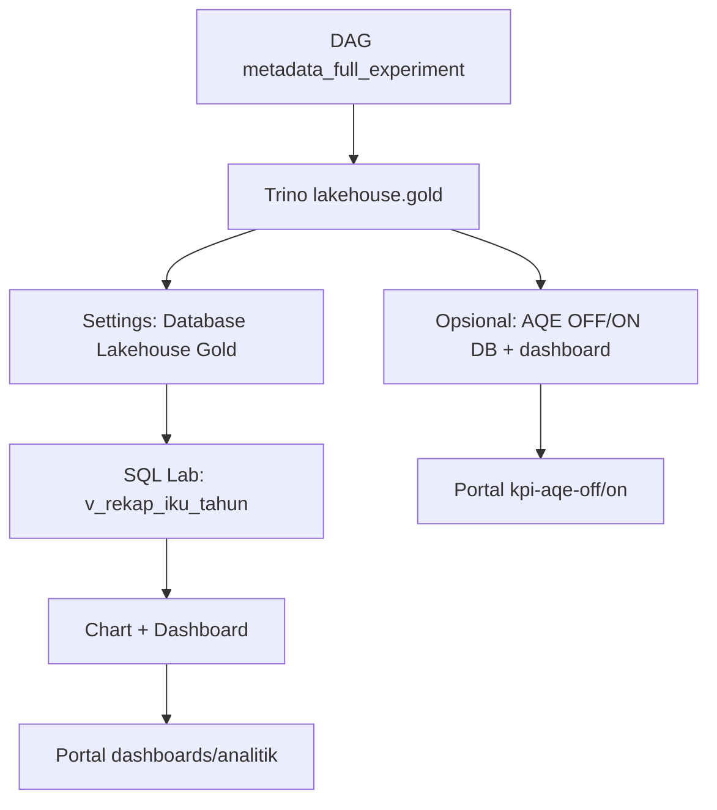

# Panduan Superset — Dashboard KPI Lakehouse (langkah demi langkah)

Panduan ini **hanya untuk Apache Superset** (dashboard KPI dari Gold).  
Jika Anda mengisi **laporan eksperimen BAB IV** (runtime DAG, metrik, UMT), pakai folder lain: [`../eksperimen/templates/`](../eksperimen/templates/) — **bukan** folder `gold-to-serving/templates/`.

| Folder | Untuk apa | Dipakai di Superset? |
|--------|-----------|----------------------|
| [`gold-to-serving/templates/`](templates/) | Checklist chart/dashboard KPI + query SQL | ✅ Ya (manual di UI) |
| [`eksperimen/templates/`](../eksperimen/templates/) | Checklist penelitian (DAG, metrik, screenshot BAB IV) | ❌ Bukan panduan klik Superset |

**URL VM Anda:** Superset `http://103.174.114.177:18089` · login **admin** / **admin**

---

## Mulai cepat (urutan wajib)

| # | Apa yang dilakukan | Menu Superset | Selesai? |
|---|-------------------|---------------|----------|
| 0 | Gold terisi + Trino jalan | (terminal, lihat §0) | ☐ |
| 1 | **Tambah koneksi DATABASE** (kalau dropdown kosong) | **Settings** → **Database connections** | ☐ |
| 2 | Buat **satu dataset** KPI (SQL Lab) | **SQL** → **SQL Lab** | ☐ |
| 3 | Buat **chart** batang 8 IKU | **Charts** → **+ Chart** | ☐ |
| 4 | Buat **dashboard** | **Dashboards** → **+ Dashboard** | ☐ |
| 5 | Embed ke portal | Portal → **URL Embed** | ☐ |
| 6 | (Opsional penelitian AQE) Ulangi dengan DB AQE OFF/ON | §6 di bawah | ☐ |

> **Jangan loncat ke Langkah 2 (Datasets)** sebelum Langkah 1 selesai — itulah penyebab layar **“Select dataset source”** dengan dropdown **DATABASE / SCHEMA / TABLE** kosong.

---

## Layar “New dataset” — isi apa?

Anda di: **Data** → **Datasets** → **+ Dataset** (atau tombol **+** → Dataset).

```
┌─────────────────────────────────────────────────────────┐
│  DATABASE ▼   ← pilih dulu (harus sudah Langkah 1)      │
│  SCHEMA   ▼   ← gold / gold_aqe_off / gold_aqe_on       │
│  TABLE    ▼   ← nama tabel, mis. fact_rekap_iku_institusi│
└─────────────────────────────────────────────────────────┘
```

### Jika dropdown DATABASE kosong

Belum ada koneksi Trino → lakukan **Langkah 1** di bawah, lalu refresh halaman.

### Isian untuk dashboard utama (cukup satu database dulu)

| Kotak di Superset | Pilih / ketik |
|-------------------|---------------|
| **DATABASE** | `Lakehouse Gold (IKU)` — nama persis saat Anda simpan koneksi |
| **SCHEMA** | `gold` |
| **TABLE** | `fact_rekap_iku_institusi` (atau `dim_waktu`, `dim_prodi`, …) |

Klik **CREATE DATASET** (tombol di kanan bawah aktif setelah ketiga field terisi).

**Rekomendasi:** untuk chart Executive 8 IKU, lebih mudah lewat **SQL Lab** (Langkah 2) — satu dataset sudah berisi `tahun` + `iku_kode` + capaian, tanpa join manual di chart.

---

## §0 Prasyarat (terminal, bukan Superset)

```bash
cd ~/Bigdata-insightera
docker compose up -d trino postgres
docker compose build superset superset-init && docker compose run --rm superset-init && docker compose up -d superset
```

Gold harus ada (jalankan DAG jika perlu):

```bash
docker exec lhmeta-airflow-scheduler airflow dags trigger metadata_full_experiment
```

Cek Trino:

```bash
docker exec lhmeta-trino trino --execute "SHOW TABLES FROM lakehouse.gold"
docker exec lhmeta-trino trino --execute \
  "SELECT COUNT(*) FROM lakehouse.gold.fact_rekap_iku_institusi"
```

Harus ada tabel `dim_waktu`, `fact_rekap_iku_institusi`, … dan COUNT > 0.

---

## Langkah 1 — Tambah koneksi DATABASE (wajib sebelum dataset)

**Menu:** kanan atas **Settings** (ikon gerigi) → **Database connections** → **+ Database**

1. Pilih jenis **Trino**
2. **Display name:** ketik persis: `Lakehouse Gold (IKU)`
3. **SQLAlchemy URI:**

   ```
   trino://admin@trino:8080/lakehouse
   ```

4. **Test connection** → harus sukses
5. **Connect** / **Save**

> URI memakai hostname `trino` (dari dalam Docker), **bukan** `103.174.114.177`.

Setelah ini, di layar **New dataset**, dropdown **DATABASE** harus menampilkan `Lakehouse Gold (IKU)`.

### (Nanti, opsional BAB IV AQE) — dua koneksi lagi

Ulangi Langkah 1 untuk baris 2–3 **hanya setelah** dashboard utama jalan:

| Display name | SQLAlchemy URI |
|--------------|----------------|
| `Lakehouse AQE OFF` | `trino://admin@trino:8080/lakehouse_aqe_off` |
| `Lakehouse AQE ON` | `trino://admin@trino:8080/lakehouse_aqe_on` |

Schema di dataset: `gold_aqe_off` / `gold_aqe_on` (bukan `gold`).

---

## Langkah 2 — Dataset KPI lewat SQL Lab (disarankan)

**Menu:** **SQL** → **SQL Lab**

| Kotak | Isi |
|-------|-----|
| **DATABASE** (atas) | `Lakehouse Gold (IKU)` |
| Editor SQL | tempel query di bawah |

```sql
SELECT w.tahun, r.iku_kode, r.iku_nama,
       r.nilai_capaian, r.nilai_target, r.satuan, r.status_capaian
FROM lakehouse.gold.fact_rekap_iku_institusi r
JOIN lakehouse.gold.dim_waktu w ON r.waktu_id = w.waktu_id
ORDER BY w.tahun, r.iku_kode;
```

1. Klik **Run** → harus ada baris (bukan error `record_count` — lihat §Troubleshooting)
2. Di bawah hasil: **Save** → **Save dataset**
3. **Dataset name:** `v_rekap_iku_tahun`
4. **Save**

**Jangan** klik nama tabel di panel kiri sebelum Run (bisa memicu bug partisi Iceberg). Cukup tempel SQL lalu Run.

Query ini juga ada di [templates/06-virtual-dataset-sql.md](templates/06-virtual-dataset-sql.md).

### Alternatif: dataset dari tabel (layar “New dataset”)

**Data** → **Datasets** → **+ Dataset** → isi seperti tabel di bagian [Layar “New dataset”](#layar-new-dataset--isi-apa) → **CREATE DATASET**.

Ulangi untuk tabel lain jika perlu (lihat [templates/01-dashboard-executive-iku.md](templates/01-dashboard-executive-iku.md)).

---

## Langkah 3 — Chart batang 8 IKU

**Menu:** **Charts** → **+ Chart** → dataset `v_rekap_iku_tahun` → **Bar Chart** → tab **Data**:

| Medan Superset (tab Data) | Pilih |
|---------------------------|--------|
| **X-Axis** | `iku_kode` |
| **Y-Axis (Metrics)** | **+ Metric** → **AVG** → `nilai_capaian` (jangan SUM untuk %) |
| **Dimensions** | *(kosong)* |
| **Filters** | `tahun` **Equal to** `2024` |
| **Customize → Orientation** | **Vertical** |

**Save chart** → `chart_executive_iku_bar`.

Peta medan UI: [templates/00-alur-superset-dataset-chart.md](templates/00-alur-superset-dataset-chart.md). Detail + chart lain: [templates/01-dashboard-executive-iku.md](templates/01-dashboard-executive-iku.md).

---

## Langkah 4 — Dashboard

**Menu:** **Dashboards** → **+ Dashboard**

1. Nama: `Executive IKU ITERA — Lakehouse Gold`
2. **Edit dashboard** → tambahkan chart `iku_executive_bar`
3. (Opsional) **+ Filter** → kolom `tahun` dari dataset `v_rekap_iku_tahun`
4. **Save**

Salin URL browser, tambahkan `?standalone=1`, contoh:

`http://103.174.114.177:18089/superset/dashboard/1/?standalone=1`

---

## Langkah 5 — Portal Insightera

1. Buka `http://103.174.114.177:13000/dashboards/analitik`
2. **URL Embed** → tempel URL dashboard Langkah 4
3. **Simpan ke server**

---

## §6 Opsional — Dashboard AQE OFF dan ON (penelitian)

**Bukan** untuk speedup pipeline (itu **Grafana** → Monitoring AQE di portal).

| Tujuan | Alat |
|--------|------|
| Banding **nilai KPI** dari salinan Gold OFF vs ON | Superset (2 dashboard) |
| Banding **durasi / speedup** AQE | Grafana + `metrics/aqe_comparison_*.json` |

Setelah Langkah 1–5 selesai untuk **Lakehouse Gold**:

1. Tambah DATABASE `Lakehouse AQE OFF` dan `Lakehouse AQE ON` (§ Langkah 1 tabel AQE)
2. SQL Lab — ganti query:

**OFF** (database = Lakehouse AQE OFF):

```sql
SELECT w.tahun, r.iku_kode, r.nilai_capaian, r.nilai_target, r.status_capaian
FROM gold_aqe_off.fact_rekap_iku_institusi r
JOIN gold_aqe_off.dim_waktu w ON r.waktu_id = w.waktu_id;
```

**ON** (database = Lakehouse AQE ON): ganti `gold_aqe_off` → `gold_aqe_on`.

3. Chart: **X-Axis** `iku_kode` · **Metrics** AVG `nilai_capaian` · Filter `tahun` (sama template 01)
4. Dashboard (judul beri suffix **AQE OFF** / **AQE ON**)
5. Embed: `/dashboards/kpi-aqe-off` dan `/dashboards/kpi-aqe-on`

Checklist: [templates/07-dashboard-kpi-aqe-off-on.md](templates/07-dashboard-kpi-aqe-off-on.md).

---

## Folder `templates/` — Dataset → Chart di setiap file

Setiap template punya **Konfigurasi Explore** (**X-Axis**, **Y-Axis/Metrics**, Filters) + checklist laporan.

| File | Dataset | X-Axis | Y-Axis (Metrics) |
|------|---------|--------|------------------|
| [00](templates/00-alur-superset-dataset-chart.md) | Peta UI Superset | — | — |
| [06](templates/06-virtual-dataset-sql.md) | SQL + diagnosa | (lihat tabel di 06) | |
| [01](templates/01-dashboard-executive-iku.md) | `v_rekap_iku_tahun` | `iku_kode` | AVG `nilai_capaian` |
| [02](templates/02-dashboard-iku-per-indikator.md) | `ds_ikuN_*` | `nama_prodi` | AVG `persen_ikuN` |
| [03](templates/03-dashboard-tata-kelola-sakip.md) | `v_tata_kelola_tahun` | `tahun` | AVG `persen_realisasi` |
| [04](templates/04-dashboard-prodi-drilldown.md) | `v_iku4_per_prodi` | `nama_prodi` | AVG `persen_iku4` |
| [07](templates/07-dashboard-kpi-aqe-off-on.md) | OFF/ON = 01 | `iku_kode` | AVG `nilai_capaian` |
| [05](templates/05-dashboard-mlops-prediktif.md) | — | **Grafana** | |

Indeks lengkap: [templates/README.md](templates/README.md)

---

## Hubungan dengan eksperimen (`docs/eksperimen/`)

| Fase penelitian | Dokumen |
|-----------------|---------|
| Jalankan DAG metadata / AQE / MLOps | [`../eksperimen/README.md`](../eksperimen/README.md) |
| Isi tabel runtime, metrik, UMT untuk laporan | [`../eksperimen/templates/`](../eksperimen/templates/) |
| Dashboard KPI di Superset | **panduan ini** + [`gold-to-serving/templates/`](templates/) |

Urutan disarankan: selesaikan **metadata_full_experiment** → Superset dashboard utama → **aqe_full_experiment** → dashboard AQE OFF/ON (opsional) → isi template eksperimen untuk BAB IV.

---

## Troubleshooting

### Dropdown DATABASE kosong di “New dataset”

→ Belum Langkah 1. **Settings** → **Database connections** → tambah Trino URI `trino://admin@trino:8080/lakehouse`.

### `Column 'record_count' cannot be resolved`

Bug Superset + Iceberg saat preview tabel di panel kiri. **Solusi:** Langkah 2 — hanya tempel SQL di editor, **Run**, jangan klik tabel di sidebar dulu. Rebuild image Superset dengan patch (`superset/patch_trino_iceberg.py`) — lihat [`superset/README.md`](../../superset/README.md).

### `schema gold does not exist`

Pipeline belum jalan: `airflow dags trigger metadata_full_experiment`.

### Query sukses tetapi **“The query returned no data”** (0 baris)

SQL benar, tetapi tabel Gold kosong atau join gagal.

```bash
docker exec lhmeta-trino trino --execute "SELECT COUNT(*) FROM lakehouse.gold.fact_rekap_iku_institusi"
docker exec lhmeta-airflow-scheduler airflow dags trigger metadata_full_experiment
```

Diagnosa lengkap + query alternatif: [templates/06-virtual-dataset-sql.md](templates/06-virtual-dataset-sql.md).

### Chart kosong

Dataset preview harus ada baris; longgarkan filter `tahun`.

---

## Diagram alur (ringkas)



---

## Dokumen lain

| Topik | File |
|-------|------|
| Koneksi Trino detail | [koneksi-trino-superset.md](koneksi-trino-superset.md) |
| Superset vs Grafana | [arsitektur-dashboard-serving.md](arsitektur-dashboard-serving.md) |
| Konsep star schema | [README.md](README.md) |
