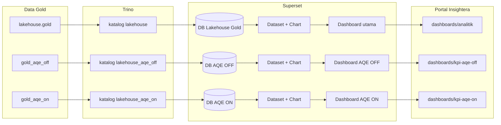

# Panduan Lengkap: Template → Dashboard Superset (Lakehouse · AQE OFF · AQE ON)

Dokumen ini menjawab: **bagaimana memakai file di folder `templates/`** dan **langkah klik demi klik** membuat tiga dashboard di Apache Superset, lalu menautkannya ke portal Insightera.

| Dokumen pendukung | Isi |
|-------------------|-----|
| [koneksi-trino-superset.md](koneksi-trino-superset.md) | Detail URI Trino & troubleshooting koneksi |
| [arsitektur-dashboard-serving.md](arsitektur-dashboard-serving.md) | Kapan Superset vs Grafana |
| [templates/](templates/) | Checklist isian per jenis dashboard (untuk laporan BAB IV) |

---

## 0. Gambaran alur (baca dulu)



**Urutan wajib:** data Gold ada → Trino bisa query → 3 koneksi Superset → dataset → chart → dashboard → URL embed portal.

---

## 1. Apa itu folder `templates/`?

Folder `templates/` **bukan** file yang di-import otomatis ke Superset. Isinya **lembar kerja** (checklist) untuk:

1. Mengetahui **chart apa** yang harus dibuat  
2. Mengetahui **tabel/dataset** mana yang dipakai  
3. Mengisi **screenshot & angka** untuk laporan penelitian (BAB IV)

| File template | Kapan dipakai | Koneksi Superset |
|---------------|---------------|------------------|
| [01-dashboard-executive-iku.md](templates/01-dashboard-executive-iku.md) | Dashboard utama 8 IKU + SAKIP | **Lakehouse Gold** → `lakehouse.gold` |
| [02-dashboard-iku-per-indikator.md](templates/02-dashboard-iku-per-indikator.md) | Drill-down IKU-1 … IKU-8 (opsional) | Lakehouse Gold |
| [03-dashboard-tata-kelola-sakip.md](templates/03-dashboard-tata-kelola-sakip.md) | Panel SAKIP & anggaran | Lakehouse Gold |
| [04-dashboard-prodi-drilldown.md](templates/04-dashboard-prodi-drilldown.md) | Per prodi / jurusan | Lakehouse Gold |
| [05-dashboard-mlops-prediktif.md](templates/05-dashboard-mlops-prediktif.md) | Forecast, Risk, … | **Grafana** (bukan Superset) |
| [06-virtual-dataset-sql.md](templates/06-virtual-dataset-sql.md) | Query SQL → dataset virtual | Salin ke SQL Lab, sesuaikan schema |
| [07-dashboard-kpi-aqe-off-on.md](templates/07-dashboard-kpi-aqe-off-on.md) | Duplikat Executive untuk audit AQE | **AQE OFF** & **AQE ON** |

**Cara memakai template:** buka file `.md` di samping editor/printout → saat membuat chart di Superset, centang panel yang sudah selesai → isi kolom kosong (capaian, screenshot).

---

## 2. Prasyarat (VM / laptop)

### 2.1 Jalankan service

```bash
cd ~/Bigdata-insightera   # atau path clone Data-Lakehouse-Insight

docker compose up -d trino superset-init superset postgres
docker compose up -d portal   # opsional, untuk embed
```

| Service | URL | Login |
|---------|-----|-------|
| Superset | http://localhost:18089 (VM: `http://103.174.114.177:18089`) | admin / admin |
| Trino CLI | `docker exec lhmeta-trino trino` | — |
| Portal | http://localhost:13000 | — |

### 2.2 Isi data Gold

| Schema | DAG / cara isi |
|--------|----------------|
| `lakehouse.gold` | `metadata_full_experiment` atau `silver_gold_pipeline` |
| `lakehouse.gold_aqe_off` | `aqe_full_experiment` (skenario OFF) |
| `lakehouse.gold_aqe_on` | `aqe_full_experiment` (skenario ON) |

```bash
docker exec lhmeta-airflow-scheduler airflow dags trigger metadata_full_experiment
# Setelah metadata selesai:
docker exec lhmeta-airflow-scheduler airflow dags trigger aqe_full_experiment
```

### 2.3 Verifikasi Trino (wajib sebelum Superset)

```bash
docker exec lhmeta-trino trino --execute "SHOW TABLES FROM lakehouse.gold"
docker exec lhmeta-trino trino --execute "SHOW TABLES FROM lakehouse.gold_aqe_off"
docker exec lhmeta-trino trino --execute "SHOW TABLES FROM lakehouse.gold_aqe_on"
```

Harus muncul tabel seperti: `dim_waktu`, `dim_prodi`, `fact_rekap_iku_institusi`, `fact_iku4_kualifikasi_dosen`, …

```bash
docker exec lhmeta-trino trino --execute \
  "SELECT COUNT(*) FROM lakehouse.gold.fact_rekap_iku_institusi"
```

Jika `0` atau error **schema does not exist** → selesaikan pipeline dulu, jangan lanjut ke Superset.

---

## 3. Langkah A — Tiga koneksi database di Superset

Buka Superset → login **admin** / **admin**.

Untuk **setiap baris** di tabel bawah, ulangi: **Settings** (⚙) → **Database connections** → **+ Database** → pilih **Trino**.

| No | Display name (nama di Superset) | SQLAlchemy URI (dari container Superset) | Schema Gold |
|----|--------------------------------|------------------------------------------|-------------|
| 1 | `Lakehouse Gold (IKU)` | `trino://admin@trino:8080/lakehouse` | `gold` |
| 2 | `Lakehouse AQE OFF` | `trino://admin@trino:8080/lakehouse_aqe_off` | `gold_aqe_off` |
| 3 | `Lakehouse AQE ON` | `trino://admin@trino:8080/lakehouse_aqe_on` | `gold_aqe_on` |

**Setiap koneksi:**

1. Tempel URI → klik **Test connection** (harus hijau / sukses)  
2. **Connect** / **Save**  
3. (Opsional) tab **Advanced** → matikan DML jika ada opsi write  

> Dari browser di luar Docker, SQL Lab bisa memakai host `localhost:18088`; koneksi **database Superset** tetap memakai hostname `trino` karena dijalankan dari container Superset.

---

## 4. Langkah B — Dataset (dasar untuk semua dashboard)

Dataset = “sumber data” untuk chart. Buat **per koneksi** (ulangi 3× dengan database berbeda).

### 4.1 Dataset fisik (tabel langsung)

**Data** → **Datasets** → **+ Dataset**

| Langkah | Koneksi 1 (Gold) | Koneksi 2 (AQE OFF) | Koneksi 3 (AQE ON) |
|---------|------------------|---------------------|---------------------|
| Database | Lakehouse Gold (IKU) | Lakehouse AQE OFF | Lakehouse AQE ON |
| Schema | `gold` | `gold_aqe_off` | `gold_aqe_on` |
| Tabel (ulangi untuk tiap baris) | lihat daftar di bawah | sama nama tabel | sama nama tabel |

**Tabel minimum (buat dataset untuk masing-masing):**

| Nama dataset (disarankan) | Tabel |
|---------------------------|-------|
| `dim_waktu` | `dim_waktu` |
| `dim_prodi` | `dim_prodi` |
| `fact_rekap_iku_institusi` | `fact_rekap_iku_institusi` |
| `fact_iku4_kualifikasi_dosen` | `fact_iku4_kualifikasi_dosen` |
| `fact_tata_kelola` | `fact_tata_kelola` |

Setelah tambah → buka dataset → **⋮** → **Sync columns from source** (jika ada) → **Preview** harus menampilkan baris.

### 4.2 Dataset virtual (disarankan untuk Executive IKU)

Lebih praktis untuk chart 8 IKU: satu dataset sudah berisi `tahun` + `iku_kode` + capaian.

1. **SQL** → **SQL Lab**  
2. Pilih **Database** = koneksi yang sesuai (mis. Lakehouse Gold)  
3. Tempel query dari [templates/06-virtual-dataset-sql.md](templates/06-virtual-dataset-sql.md) bagian **v_rekap_iku_tahun**  
4. Sesuaikan prefix:

| Koneksi | Ganti `lakehouse.gold` menjadi |
|---------|-------------------------------|
| Lakehouse Gold | `lakehouse.gold` (tetap) |
| AQE OFF | `gold_aqe_off` (cukup schema, karena katalog sudah `lakehouse_aqe_off`) |
| AQE ON | `gold_aqe_on` |

**Contoh untuk koneksi Lakehouse Gold (katalog `lakehouse`):**

```sql
SELECT w.tahun, r.iku_kode, r.iku_nama,
       r.nilai_capaian, r.nilai_target, r.satuan, r.status_capaian
FROM lakehouse.gold.fact_rekap_iku_institusi r
JOIN lakehouse.gold.dim_waktu w ON r.waktu_id = w.waktu_id
ORDER BY w.tahun, r.iku_kode;
```

**Contoh untuk koneksi Lakehouse AQE OFF** (katalog `lakehouse_aqe_off`, schema default `gold_aqe_off`):

```sql
SELECT w.tahun, r.iku_kode, r.iku_nama,
       r.nilai_capaian, r.nilai_target, r.satuan, r.status_capaian
FROM gold_aqe_off.fact_rekap_iku_institusi r
JOIN gold_aqe_off.dim_waktu w ON r.waktu_id = w.waktu_id
ORDER BY w.tahun, r.iku_kode;
```

5. **Run** → pastikan ada baris  
6. **Save** → **Save dataset** → nama mis. `v_rekap_iku_tahun`  
7. Ulangi query yang sama (dengan schema berbeda) untuk koneksi **AQE ON** → simpan sebagai `v_rekap_iku_tahun` juga (beda database, nama boleh sama)

---

## 5. Langkah C — Dashboard **Lakehouse Gold** (utama)

Ikuti checklist [templates/01-dashboard-executive-iku.md](templates/01-dashboard-executive-iku.md).

### C.1 Chart — Bar 8 IKU

1. **Charts** → **+ Chart**  
2. **Dataset:** `v_rekap_iku_tahun` (koneksi Lakehouse Gold)  
3. **Chart type:** Bar Chart  
4. **Query:**  
   - **Dimensions:** `iku_kode` (atau `iku_nama`)  
   - **Metrics:** `AVG(nilai_capaian)` atau `SUM(nilai_capaian)` — untuk persen gunakan **AVG**  
   - **Filters:** `tahun` = `2024` (sesuaikan)  
5. **Customize** → judul: `Capaian 8 IKU — Lakehouse Gold`  
6. **Save** → nama chart: `iku_executive_bar`

### C.2 Chart — Heatmap / tabel status (opsional)

- Dataset: `v_rekap_iku_tahun`  
- Pivot atau Table: baris `iku_kode`, kolom `status_capaian` atau bandingkan `nilai_capaian` vs `nilai_target`

### C.3 Chart — Tata kelola (opsional)

- Dataset: `fact_tata_kelola` + join `dim_waktu` (atau buat virtual dataset dari template 03)  
- Line chart: `tahun` × `persen_realisasi`

### C.4 Susun dashboard

1. **Dashboards** → **+ Dashboard**  
2. Nama: `Executive IKU ITERA — Lakehouse Gold`  
3. **Edit dashboard** → drag chart `iku_executive_bar` (+ chart lain)  
4. **Filters** → **+ Filter** → hubungkan ke kolom `tahun` (dataset `v_rekap_iku_tahun`)  
5. **Save**  
6. Buka dashboard → salin **URL** dari address bar, contoh:  
   `http://103.174.114.177:18089/superset/dashboard/5/`  
7. Tambahkan `?standalone=1` untuk embed:  
   `http://103.174.114.177:18089/superset/dashboard/5/?standalone=1`

### C.5 Sematkan ke portal

1. Buka portal → **Dashboard Analitik** (`/dashboards/analitik`)  
2. **URL Embed** → tempel URL langkah C.4  
3. **Simpan ke server**

Atau di VM `.env`:

```bash
LHINSIGHT_SUPERSET_EMBED_PATH=/superset/dashboard/5/?standalone=1
```

Lalu `docker compose up -d portal`.

---

## 6. Langkah D — Dashboard **Lakehouse AQE OFF**

Prinsip: **sama persis** dengan Langkah C, tetapi:

| Item | Nilai |
|------|-------|
| Database / koneksi | `Lakehouse AQE OFF` |
| Schema | `gold_aqe_off` |
| Dataset virtual | query dengan prefix `gold_aqe_off.*` |
| Judul chart/dashboard | tambahkan suffix **「AQE OFF」** |

Checklist: [templates/07-dashboard-kpi-aqe-off-on.md](templates/07-dashboard-kpi-aqe-off-on.md)

1. Buat chart bar dari `v_rekap_iku_tahun` (koneksi OFF)  
2. **Dashboards** → **+ Dashboard** → `Executive IKU — AQE OFF`  
3. Salin URL embed → portal **KPI AQE OFF** (`/dashboards/kpi-aqe-off`)

**Cara cepat (duplikasi):** setelah dashboard Gold jadi, di Superset buka dashboard Gold → **⋮** → **Duplicate** (jika tersedia) → ganti dataset ke versi koneksi OFF. Jika tidak ada Duplicate, buat chart baru dengan dataset OFF lalu susun ulang.

---

## 7. Langkah E — Dashboard **Lakehouse AQE ON**

Ulangi Langkah D dengan:

| Item | Nilai |
|------|-------|
| Koneksi | `Lakehouse AQE ON` |
| Schema | `gold_aqe_on` |
| Suffix judul | **「AQE ON」** |
| Portal | `/dashboards/kpi-aqe-on` |

---

## 8. Bandingkan OFF vs ON (verifikasi penelitian)

Di **SQL Lab** (database mana saja yang bisa lihat kedua schema, atau gunakan katalog `lakehouse`):

```sql
SELECT 'OFF' AS konteks, iku_kode, nilai_capaian
FROM lakehouse.gold_aqe_off.fact_rekap_iku_institusi
UNION ALL
SELECT 'ON', iku_kode, nilai_capaian
FROM lakehouse.gold_aqe_on.fact_rekap_iku_institusi
ORDER BY iku_kode, konteks;
```

| Hasil | Arti |
|-------|------|
| Nilai mendekati | Parity data OK — perbedaan performa ada di **Grafana Monitoring AQE** |
| Jauh berbeda / kosong | Cek DAG `aqe_full_experiment` belum selesai atau gagal |

**Speedup pipeline** → bukan di Superset; buka Grafana **Monitoring AQE** di portal.

---

## 9. Template lanjutan (opsional)

Setelah Executive (template 01) untuk **Lakehouse Gold**:

| Urutan | Template | Aksi di Superset |
|--------|----------|------------------|
| 1 | [02](templates/02-dashboard-iku-per-indikator.md) | Satu chart per `fact_iku1` … `fact_iku8` |
| 2 | [03](templates/03-dashboard-tata-kelola-sakip.md) | Chart dari `fact_tata_kelola` |
| 3 | [04](templates/04-dashboard-prodi-drilldown.md) | Chart `fact_iku4` + `dim_prodi` |
| 4 | [05](templates/05-dashboard-mlops-prediktif.md) | Di **Grafana**, setelah `mlops_pipeline` |

Semua template 02–04 memakai **hanya koneksi Lakehouse Gold** kecuali Anda sengaja menduplikasi untuk audit AQE.

---

## 10. Ringkasan URL portal

| Dashboard Superset | Path portal | Env (opsional) |
|--------------------|-------------|----------------|
| Lakehouse Gold | `/dashboards/analitik` | `LHINSIGHT_SUPERSET_EMBED_PATH` |
| AQE OFF | `/dashboards/kpi-aqe-off` | `LHINSIGHT_SUPERSET_EMBED_AQE_OFF_PATH` |
| AQE ON | `/dashboards/kpi-aqe-on` | `LHINSIGHT_SUPERSET_EMBED_AQE_ON_PATH` |

Format embed: `http://<IP-VM>:18089/superset/dashboard/<ID>/?standalone=1`

---

## 11. Troubleshooting

| Gejala | Penyebab | Solusi |
|--------|----------|--------|
| Test connection gagal | Trino mati | `docker compose up -d trino` |
| Schema `gold` tidak ada | Pipeline belum jalan | Trigger `metadata_full_experiment` |
| `gold_aqe_off` kosong | AQE DAG belum jalan | Trigger `aqe_full_experiment` |
| Chart kosong | Filter tahun salah / data 0 | Cek preview dataset; longgarkan filter |
| `% IKU salah` | SUM pada kolom persen | Pakai **AVG** |
| Embed portal blank | Belum login Superset / URL salah | Buka URL embed di tab baru; login sekali |
| Hanya 1 dashboard perlu | Penelitian operasional | Cukup Langkah C; OFF/ON opsional BAB IV |
| **`Column 'record_count' cannot be resolved`** | Bukan kolom tabel — metadata partisi Iceberg (`file_count`, `record_count`, `total_size`) ikut terpilih di chart | Hapus metrik `record_count`; pakai kolom data saja atau `COUNT(*)` — lihat §11.1 |

### 11.1 Error `record_count` / `file_count` (Superset + Trino)

Pesan seperti:

```text
Column 'record_count' cannot be resolved
```

sering muncul pada dataset **`dim_waktu`** (atau tabel Iceberg lain) ketika di chart/metric/filter terpilih **`record_count`**, **`file_count`**, atau **`total_size`**.

Itu **bukan** kolom star schema. Teks `Latest partition: .../record_count=72/...` di UI Superset hanya **statistik file Iceberg**, bukan field yang bisa di-`SELECT`.

**Kolom valid `dim_waktu`:**

| Kolom | Tipe |
|-------|------|
| `waktu_id` | BIGINT |
| `tahun` | BIGINT |
| `semester` | VARCHAR |
| `triwulan` | BIGINT |
| `bulan` | BIGINT |
| `nama_bulan` | VARCHAR |

**Perbaikan di Superset:**

1. **Data** → **Datasets** → buka dataset bermasalah (mis. `dim_waktu`)  
2. **⋮** → **Sync columns from source**  
3. Tab **Columns** → hapus / jangan pakai `record_count`, `file_count`, `total_size` jika muncul  
4. Buka **chart** yang error → **Metrics**: ganti `record_count` → **COUNT(\*)** atau hapus metrik  
5. **Filters / Dimensions**: hanya `tahun`, `bulan`, `semester`, dll.

**Uji di SQL Lab (harus sukses):**

```sql
SELECT waktu_id, tahun, semester, triwulan, bulan, nama_bulan
FROM lakehouse.gold.dim_waktu
ORDER BY tahun, bulan
LIMIT 20;
```

Untuk jumlah baris:

```sql
SELECT COUNT(*) AS jumlah_baris FROM lakehouse.gold.dim_waktu;
```

Jangan: `SELECT record_count FROM lakehouse.gold.dim_waktu`.

---

## 12. Checklist selesai

**Lakehouse Gold**

- [ ] Koneksi `Lakehouse Gold (IKU)`  
- [ ] Dataset `v_rekap_iku_tahun` + minimal 3 tabel fakta/dim  
- [ ] Dashboard Executive + filter tahun  
- [ ] URL embed di `/dashboards/analitik`  
- [ ] Template 01 terisi + screenshot  

**AQE OFF**

- [ ] Koneksi `Lakehouse AQE OFF`  
- [ ] Dataset virtual `gold_aqe_off`  
- [ ] Dashboard + embed `/dashboards/kpi-aqe-off`  
- [ ] Template 07 (bagian OFF)  

**AQE ON**

- [ ] Koneksi `Lakehouse AQE ON`  
- [ ] Dashboard + embed `/dashboards/kpi-aqe-on`  
- [ ] Template 07 (bagian ON)  
- [ ] Query banding OFF vs ON di SQL Lab  

---

**Dokumen terkait:** [README.md](README.md) · [koneksi-trino-superset.md](koneksi-trino-superset.md) · [templates/README.md](templates/README.md)
