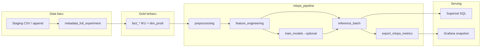

# Panduan MLOps — Model, Metrik, Inference & Superset

Acuan kode: [`../../scripts/mlops/`](../../scripts/mlops/) · DAG: `mlops_pipeline` · Monitoring: [`../monitoring-grafana/README.md`](../monitoring-grafana/README.md) · Dashboard KPI deskriptif: [`../gold-to-serving/README.md`](../gold-to-serving/README.md)

---

## 1. Empat use case & peran alat

| Use case | Tipe ML | Output Gold | Dashboard utama |
|----------|---------|-------------|-----------------|
| **Forecast** | Regresi / deret waktu | `fact_forecast_iku_mlops` | **Superset** (trend) + Grafana (snapshot) |
| **Risk Score** | Klasifikasi atau regresi | `fact_risk_score_mlops` | **Superset** (bar per prodi) + Grafana |
| **Opportunity** | Clustering / ranking | `fact_opportunity_mlops` *(rencana)* | Superset |
| **Anomalies** | Deteksi anomali (unsupervised) | `fact_anomaly_mlops` *(rencana)* | Superset + Grafana |

**Pemisahan tanggung jawab**

- **Superset** — analitik prediktif terstruktur (SQL ke tabel `fact_*_mlops`, filter prodi/tahun/IKU), melengkapi dashboard IKU deskriptif.
- **Grafana** — monitoring pipeline, snapshot metrik ekspor (`lakehouse_insight_*`), durasi DAG MLOps.
- **MLflow** — registry model, parameter, metrik latih (`http://localhost:15500`).

---

## 2. Data Gold yang tersedia (basis fitur)

Setelah `metadata_full_experiment` / `silver_to_gold` dengan populasi ITERA (~22,6k mahasiswa, 42 prodi):

| Sumber Gold | Kolom kunci | Dipakai untuk |
|-------------|-------------|---------------|
| `fact_rekap_iku_institusi` | `waktu_id`, `iku_kode`, `nilai_capaian`, `nilai_target`, `status_capaian` | **Forecast** institusi, **Anomaly** pada rekap |
| `fact_iku1_lulusan` … `fact_iku8_*` | `prodi_id` / `jurusan_id`, `persen_iku*`, `capaian_iku`, `target_iku` | **Risk**, **Opportunity**, drill-down prodi |
| `dim_prodi` | `prodi_id`, `fakultas_id`, `nama_fakultas` (42 baris) | Join semua use case per prodi |
| `dim_waktu` | `tahun`, `waktu_id` | Agregasi tahunan |
| `dim_mahasiswa`, `dim_dosen` | profil, flag | Fitur tambahan Risk (proporsi S3, MBKM, dll.) |
| Silver (`silver_mahasiswa`, `silver_dosen`, …) | enriched | Fitur detail bila perlu retrain |

**Keterbatasan data (penting untuk pemilihan model)**

- Deret waktu IKU institusi: ~**6 tahun** × 8 IKU ≈ puluhan baris di `fact_rekap_iku_institusi` — **bukan** big data time series.
- Grain prodi: **42 prodi** × beberapa tahun → ratusan baris untuk klasifikasi/clustering — cukup untuk **model tabular ringan**, kurang untuk deep learning.

Oleh karena itu rekomendasi di bawah mengutamakan **Spark MLlib** / **scikit-learn** / **statsmodels**, bukan model besar.

---

## 3. Rekomendasi model per use case

### 3.1 Forecast — prediksi capaian IKU

**Target:** `nilai_capaian` (atau rata institusi) untuk tahun mendatang, per `iku_kode` atau agregat.

**Fitur (contoh SQL feature store):**

```sql
SELECT w.tahun, r.iku_kode, r.nilai_capaian, r.nilai_target,
       r.nilai_capaian - r.nilai_target AS gap
FROM lakehouse.gold.fact_rekap_iku_institusi r
JOIN lakehouse.gold.dim_waktu w ON r.waktu_id = w.waktu_id;
```

| Prioritas | Library / model | Alasan |
|-----------|-----------------|--------|
| **1 (disarankan)** | **statsmodels** — `ExponentialSmoothing` / Holt-Winters | Sedikit titik tahunan, interpretable, cepat |
| **2** | **scikit-learn** — `Ridge` / `ElasticNet` pada lag (`t-1`, `t-2`) | Mudah di-MLflow, metrik RMSE/MAE jelas |
| **3** | **Spark MLlib** — `GBTRegressor` atau `LinearRegression` | Jika fitur >1k baris (mis. per prodi × tahun × IKU) |
| **4 (opsional)** | **Prophet** (`prophet`) | Jika nanti ada data bulanan + musiman jelas |
| Hindari | LSTM / Transformer | Data terlalu sedikit → overfit |

**Metrik evaluasi (regresi / forecast)**

| Metrik | Formula / arti | Target laporan |
|--------|----------------|----------------|
| **MAE** | Rata-rata \|aktual − prediksi\| | Utama — mudah dibaca (poin persen IKU) |
| **RMSE** | Akar MSE | Sensitif outlier |
| **MAPE** | % error relatif | Hati-hati jika aktual ≈ 0 |
| **sMAPE** | Symmetric MAPE | Stabil untuk KPI % |
| **R²** | Varian terjelaskan | Tambahan di MLflow |

**Baseline wajib:** naive forecast (nilai tahun lalu) — model baru harus mengalahkan baseline di MLflow.

---

### 3.2 Risk Score — risiko capaian IKU rendah per prodi

**Target bisnis:** skor **0–100** (tinggi = risiko tinggi) atau kelas `{rendah, sedang, tinggi}`.

**Label (klasifikasi):**

```text
risk_label = 1  jika capaian_iku < target_iku  atau  persen_iku4 < target
              0  jika memenuhi target
```

**Fitur per `prodi_id` (join beberapa fakta):**

| Fitur | Sumber |
|-------|--------|
| `persen_iku2`, `persen_iku4`, `persen_iku3` | `fact_iku2_mbkm`, `fact_iku4_*`, `fact_iku3_*` |
| `total_dosen_tetap`, `dosen_s3` | `fact_iku4_kualifikasi_dosen` |
| `fakultas_id` | `dim_prodi` |
| Proporsi mahasiswa MBKM | agregat dari `fact_iku2` / Silver |

| Prioritas | Library / model | Alasan |
|-----------|-----------------|--------|
| **1 (sudah di repo)** | **scikit-learn** — `RandomForestClassifier` | [`train_models.py`](../../scripts/mlops/train_models.py) — robust, sedikit hyperparameter |
| **2 (disarankan produksi)** | **Spark MLlib** — `GBTClassifier` atau `RandomForestClassifier` | Skala jika fitur dari semua prodi × tahun di Spark |
| **3** | **XGBoost** (`xgboost`) | Akurasi tinggi pada data tabular kecil–menengah |
| **4** | **Spark MLlib** — `LogisticRegression` | Baseline interpretable (koefisien) |
| Alternatif | Regresi `GBTRegressor` pada `gap = target - capaian` → skala ke 0–100 | Satu angka kontinu |

**Metrik evaluasi (klasifikasi)**

| Metrik | Kapan dipakai |
|--------|----------------|
| **Accuracy** | Kelas seimbang |
| **Precision / Recall / F1** (macro) | Kelas tidak seimbang (minority “berisiko”) |
| **ROC-AUC** | Threshold fleksibel untuk skor risiko |
| **Confusion matrix** | Laporan BAB IV / MLflow artefak |

**Metrik jika regresi skor 0–100:** RMSE, MAE pada hold-out prodi.

---

### 3.3 Opportunity — peluang peningkatan per prodi

**Target:** `opportunity_score` 0–100 + label cluster (`high_research`, `mbkm_growth`, …).

**Fitur:** vektor KPI multi-indikator per prodi (IKU-2,4,5,6,7 normalisasi MinMax).

| Prioritas | Library / model | Alasan |
|-----------|-----------------|--------|
| **1 (disarankan)** | **Spark MLlib** — `KMeans` (k=3..5) | Selaras stack Spark; 42 prodi × fitur → ringan |
| **2** | **scikit-learn** — `KMeans` / `GaussianMixture` | Prototipe cepat di notebook |
| **3** | **sklearn** — `DBSCAN` | Jika ingin deteksi prodi “outlier positif” tanpa k tetap |
| Skor | Jarak ke centroid “ideal” atau persentil dalam cluster terbaik | Ubah cluster → `opportunity_score` |

**Metrik evaluasi (clustering — tanpa label emas)**

| Metrik | Arti |
|--------|------|
| **Silhouette** | Kohesi cluster (−1..1, lebih tinggi lebih baik) |
| **Davies–Bouldin** | Lebih rendah lebih baik |
| **Calinski–Harabasz** | Rasio antar/intra cluster |

Validasi bisnis: review manual 3–5 prodi per cluster di Superset.

---

### 3.4 Anomalies — deteksi capaian IKU tidak wajar

**Target:** flag anomali pada titik `(tahun, iku_kode, prodi_id)` atau pada residual forecast.

| Prioritas | Library / model | Alasan |
|-----------|-----------------|--------|
| **1 (disarankan)** | **scikit-learn** — `IsolationForest` | Cepat, cocok dimensi sedang |
| **2** | **PyOD** — `LOF`, `COPOD` | Benchmark beberapa detector di MLflow |
| **3** | **Spark MLlib** — normalisasi + rule: \|z-score\| > 3 | Transparan untuk auditor |
| **4** | Residual forecast | Anomali = \|aktual − forecast\| > 2×RMSE validasi |

**Metrik evaluasi**

| Metrik | Catatan |
|--------|---------|
| **Precision@k / Recall@k** | Jika ada label insiden (audit manual) |
| **Anomaly rate %** | `anomaly_count / total` — pantau di Grafana |
| **F1 pada sintetik** | Inject 5% outlier saat penelitian untuk bukti metodologi |

---

## 4. Peta library “MLlib” dalam proyek ini

| Lapisan | Paket | Peran |
|---------|-------|------|
| **Spark MLlib** (`pyspark.ml`) | `GBTClassifier`, `RandomForest`, `KMeans`, `VectorAssembler`, `StandardScaler` | Training terdistribusi, feature dari Gold besar |
| **scikit-learn** | RF, IsolationForest, Ridge, KMeans | Training lokal di Airflow worker (sudah dipakai Risk) |
| **statsmodels** | ETS / Holt-Winters | Forecast tahunan IKU |
| **MLflow** | Registry + metrik | `train_models.py`, UI port 15500 |
| **Opsional** | `prophet`, `xgboost`, `pyod` | Tambah di `requirements` bila disetujui |

---

## 5. Alur inference saat data baru masuk



### 5.1 Kapan menjalankan pipeline

| Peristiwa | Perintah |
|-----------|----------|
| Setelah Gold utama terisi | `docker exec lhmeta-airflow-scheduler airflow dags trigger mlops_pipeline` |
| Setelah generate data baru | `metadata_full_experiment` sukses → lalu `mlops_pipeline` |
| Retrain mingguan/bulanan | Trigger penuh (termasuk `train_models`) |
| **Inference saja** (model sudah di MLflow) | Jalankan task `inference_batch` atau skrip di bawah |

### 5.2 Inference batch (implementasi saat ini)

[`inference_batch.py`](../../scripts/mlops/inference_batch.py):

1. Baca `fact_rekap_iku_institusi` + `dim_waktu` → deret forecast (naive trend).
2. Tulis `lakehouse.gold.fact_risk_score_mlops`, `fact_forecast_iku_mlops`.
3. Return payload untuk `export_mlops_metrics` → Grafana.

**Langkah berikutnya (disarankan):** muat model dari MLflow di inference, bukan hardcode baris demo.

```python
# Pola target (belum di repo — acuan implementasi)
import mlflow.sklearn
model = mlflow.sklearn.load_model("models:/risk_score_prodi/Production")
# score semua prodi dari feature parquet s3a://mlops/features/
```

### 5.3 Feature store

Output: `s3a://mlops/features/iku_features` dari [`feature_engineering.py`](../../scripts/mlops/feature_engineering.py) — join rekap IKU × waktu. Perluas dengan pivot per `prodi_id` untuk Risk/Opportunity.

---

## 6. Metrik di MLflow & `metrics/mlops_*.json`

Setiap model log ke experiment terpisah:

| Experiment MLflow | Metrik utama | Tipe |
|-------------------|--------------|------|
| `forecast_iku` | `mae`, `rmse`, `mape` | Forecast |
| `risk_score_prodi` | `accuracy`, `f1_macro`, `roc_auc` | Klasifikasi |
| `opportunity_prodi` | `silhouette` | Clustering |
| `anomaly_iku` | `precision_at_k`, `anomaly_rate` | Anomali |

File agregat: `metrics/runs/mlops_*/mlops_metrics_*.json` → mirror `metrics/latest/mlops/mlops_metrics.json` → Grafana [`metrics_exporter.py`](../../scripts/benchmark/metrics_exporter.py).

Template isian BAB IV: [`../eksperimen/templates/10-metrik-mlops.md`](../eksperimen/templates/10-metrik-mlops.md).

---

## 7. Panduan Superset — dashboard prediktif

> KPI **deskriptif** (8 IKU dari star schema) tetap di [`../gold-to-serving/templates/01-dashboard-executive-iku.md`](../gold-to-serving/templates/01-dashboard-executive-iku.md).  
> Bagian ini khusus tabel **output MLOps**.

### 7.1 Prasyarat

```bash
docker exec lhmeta-trino trino --execute "SHOW TABLES FROM lakehouse.gold LIKE '%mlops%'"
docker exec lhmeta-airflow-scheduler airflow dags trigger mlops_pipeline
```

Harus terlihat minimal: `fact_risk_score_mlops`, `fact_forecast_iku_mlops`.

### 7.2 Koneksi Superset

Database: **Lakehouse Gold (IKU)** — `trino://admin@trino:8080/lakehouse` (sama dengan dashboard IKU).  
Panduan: [`../gold-to-serving/koneksi-trino-superset.md`](../gold-to-serving/koneksi-trino-superset.md).

### 7.3 Virtual dataset SQL

#### `v_forecast_iku_mlops`

```sql
SELECT tahun,
       nilai_capaian,
       CASE WHEN is_forecast = 1 THEN 'forecast' ELSE 'actual' END AS series_type
FROM lakehouse.gold.fact_forecast_iku_mlops
ORDER BY tahun;
```

| Chart | X-Axis | Y-Axis | Tipe |
|-------|--------|--------|------|
| Line / Bar | `tahun` | `nilai_capaian` | Series: `series_type` |

**Metrik tampilan:** bandingkan dengan `nilai_target` dari `fact_rekap_iku_institusi` (dataset terpisah).

#### `v_risk_score_prodi`

```sql
SELECT r.tahun, r.prodi_id, p.nama_prodi, p.fakultas_id, p.nama_fakultas,
       r.risk_score, r.scored_at
FROM lakehouse.gold.fact_risk_score_mlops r
LEFT JOIN lakehouse.gold.dim_prodi p ON r.prodi_id = p.prodi_id
ORDER BY r.risk_score DESC;
```

| Chart | X-Axis | Y-Axis | Catatan |
|-------|--------|--------|---------|
| Bar horizontal | `nama_prodi` | **AVG** `risk_score` | Filter `tahun` |
| Table | — | semua kolom | Audit skor |

Threshold warna: &lt; 60 merah, ≥ 80 hijau (selaras Grafana).

#### `v_opportunity_prodi` *(setelah tabel `fact_opportunity_mlops`)*

```sql
SELECT o.prodi_id, p.nama_prodi, p.nama_fakultas,
       o.cluster, o.opportunity_score, o.scored_at
FROM lakehouse.gold.fact_opportunity_mlops o
JOIN lakehouse.gold.dim_prodi p ON o.prodi_id = p.prodi_id;
```

#### `v_anomaly_iku` *(setelah tabel `fact_anomaly_mlops`)*

```sql
SELECT tahun, iku_code, prodi_id, metric_name, nilai, is_anomaly, anomaly_score
FROM lakehouse.gold.fact_anomaly_mlops
WHERE is_anomaly = 1
ORDER BY anomaly_score DESC;
```

| Chart | X-Axis | Y-Axis |
|-------|--------|--------|
| Bar | `iku_code` | **COUNT** `*` |
| Big number | — | **COUNT** WHERE `is_anomaly=1` |

### 7.4 Dashboard gabungan “Insight Prediktif”

| Panel | Dataset | Visual |
|-------|---------|--------|
| P1 | `v_forecast_iku_mlops` | Line actual vs forecast |
| P2 | `v_risk_score_prodi` | Bar risk per prodi |
| P3 | `v_opportunity_prodi` | Bar opportunity + filter `cluster` |
| P4 | `v_anomaly_iku` | Tabel / bar count anomali |
| Filter global | — | `tahun`, `fakultas_id` |

Simpan dashboard: **Insight Prediktif ITERA — MLOps** · embed portal `/dashboards/analitik` (tab kedua) jika dikonfigurasi.

### 7.5 Gabung deskriptif + prediktif (contoh)

Satu halaman dengan 2 dataset:

```sql
-- Capaian aktual (deskriptif)
SELECT w.tahun, r.iku_kode, r.nilai_capaian AS actual
FROM lakehouse.gold.fact_rekap_iku_institusi r
JOIN lakehouse.gold.dim_waktu w ON r.waktu_id = w.waktu_id;

-- Prediksi (prediktif) — UNION di virtual dataset atau 2 chart terpisah
```

---

## 8. Ringkasan rekomendasi implementasi

| Use case | Model utama | Library | Metrik wajib | Tabel Gold output |
|----------|-------------|---------|--------------|-------------------|
| Forecast | ETS / Ridge lag | statsmodels + sklearn | MAE, RMSE, MAPE | `fact_forecast_iku_mlops` |
| Risk Score | GBT / Random Forest | Spark MLlib atau sklearn | Accuracy, F1, ROC-AUC | `fact_risk_score_mlops` |
| Opportunity | K-Means k=4 | Spark MLlib | Silhouette | `fact_opportunity_mlops` |
| Anomalies | Isolation Forest | sklearn / PyOD | Rate %, Precision@k | `fact_anomaly_mlops` |

**Urutan pengembangan di repo**

1. Perluas `feature_engineering.py` → fitur per `prodi_id`.
2. Implement train Forecast + Anomaly + Opportunity di `train_models.py` (MLflow).
3. `inference_batch.py` muat model Production + append skor semua prodi.
4. Buat virtual dataset Superset (§7) + screenshot ke template 10.

---

## 9. Referensi

| Dokumen | Isi |
|---------|-----|
| [`README.md`](README.md) | Ringkasan modul & DAG |
| [`../gold-to-serving/templates/05-dashboard-mlops-prediktif.md`](../gold-to-serving/templates/05-dashboard-mlops-prediktif.md) | Checklist Grafana + Superset |
| [`../gold-to-serving/templates/08-mlops-superset-sql.md`](../gold-to-serving/templates/08-mlops-superset-sql.md) | Salinan query Superset siap pakai |
| [`../monitoring-grafana/README.md`](../monitoring-grafana/README.md) | Panel `lakehouse_insight_*` |
